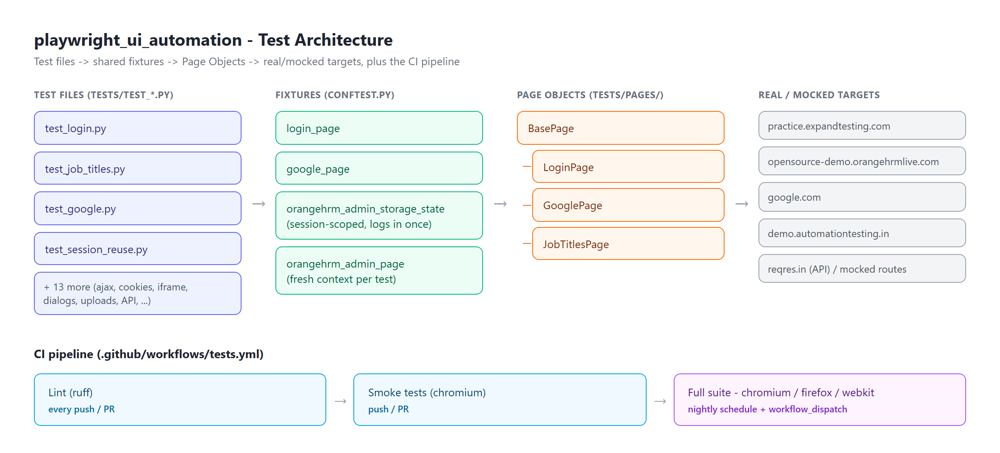
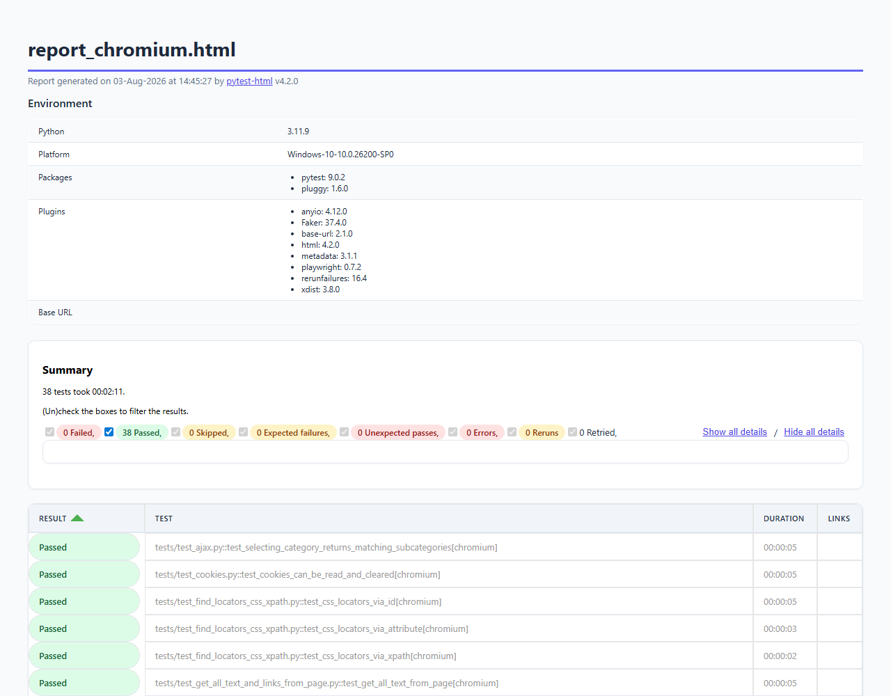
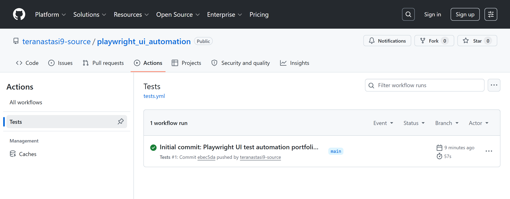

# Playwright UI Test Automation

[](https://github.com/teranastasi9-source/playwright_ui_automation/actions/workflows/tests.yml)

Purpose: Python-based UI test automation framework built with [Playwright](https://playwright.dev/python/) and [pytest](https://docs.pytest.org/). Portfolio demonstration of UI automation, Page Object Model, and pytest best practices.

## Project Overview

| Aspect | Details |
|------|--------------------------------------------|
|**Tool**| Pytest + Playwright (`pytest-playwright`) |
|**Pattern**| Page Object Model, pytest fixtures, config-driven test data |
|**Test Types**| UI flows, API requests, network mocking, session reuse, hybrid API+UI, CRUD |
|**Auth**| Session reuse via `storage_state` (OrangeHRM demo) |
|**Reports**| HTML via `pytest-html`, live logging via `log_cli` |

## This project demonstrates:
  - Page Object Model (`tests/pages/`, with a shared `BasePage`)
  - pytest fixtures for dependency injection (`login_page`, `google_page`, `orangehrm_admin_page`)
  - Data-driven tests via `@pytest.mark.parametrize`, reading cases from JSON
  - API testing with Playwright's `request` fixture
  - Network mocking with `page.route()` - a deterministic happy-path and an API-error scenario
  - Session reuse via `storage_state` - login once per test session, inject the resulting
    cookies into a fresh, isolated `BrowserContext` per test
  - A hybrid API+UI test: create data via a direct API call, verify it renders in the UI
  - A self-contained CRUD scenario that creates, verifies and cleans up its own test data
    instead of asserting against shared/mutable third-party demo content
  - iframe handling via `frame_locator()`
  - A deliberate, opt-in retry policy (`pytest-rerunfailures`) for the one test with a known,
    understood external timing flake - not a blanket retry over the whole suite
  - Cross-browser CI (Chromium/Firefox/WebKit matrix) - actually run and verified, surfacing
    two real per-engine site differences instead of just claiming `--browser` support works
  - Parallel execution (`pytest-xdist`) - actually run cross-browser under `-n auto`, which
    surfaced and fixed a real file-naming race between concurrently-running tests
  - File upload/download, dialogs, multiple tabs, cookies, screenshots/video recording,
    dropdowns/checkboxes/radio buttons, and CSS/XPath locator strategies
  - Documentation and reproducibility practices

## Project structure



```
playwright_ui_automation/
  .github/workflows/tests.yml   - CI: lint + smoke on push/PR, full suite nightly/manual
  .claude/skills/                - project-scoped Claude Code skills (see below)
  pytest.ini                       - pytest config (HTML report, live logging, markers)
  report_style.css               - custom theme applied to the pytest-html report
  requirements.txt                 - runtime dependencies
  requirements-dev.txt              - + ruff, for linting
  pyproject.toml                     - ruff config
  docs/architecture.png            - diagram above (tests -> fixtures -> Page Objects -> targets, + CI)
  docs/report_screenshot.png       - report screenshot embedded below, for a no-clone preview
  docs/github_actions.png          - CI run screenshot, embedded in "Cross-browser testing" below
  test_data/                          - JSON/CSV fixtures, sample upload file, local iframe fixture
  reports/                             - committed HTML report + log per browser, + screenshots/video from the last run
  tests/
    conftest.py                       - shared fixtures (login_page, google_page, orangehrm_admin_page),
                                         plus a hook that attaches a screenshot to the HTML report on failure
    config.py                       - named URL constants for every demo site used
    helpers.py                      - small cross-test helpers (e.g. dismissing a site's
                                       cookie-consent dialog on browsers where it renders)
    pages/
      base_page.py                  - shared navigation/interaction helpers
      demowebsite_login_page.py
      google_search_page.py
      job_titles_page.py
    test_*.py                       - one scenario/topic per file (see table below)
```

## Test scenarios overview

| File | Verifies |
|------|----------|
| `test_login.py` | Valid login, invalid username/password, and data-driven credential combinations (expandtesting.com) |
| `test_google.py` | google.com homepage title; Google search results page title |
| `test_job_titles.py` | CRUD against a real backend; UI renders mocked API data / survives a mocked API error; data created via a direct API call is visible in the UI (OrangeHRM) |
| `test_session_reuse.py` | Authenticated pages are reachable without repeating the login flow |
| `test_iframe.py` | Typing into an editable area inside an iframe |
| `test_api_requests.py` | GET/POST requests against a public REST API |
| `test_ajax.py` | An AJAX-driven dropdown returns the correct subcategories |
| `test_cookies.py` | Reading and clearing browser cookies |
| `test_find_locators_css_xpath.py` | CSS id/attribute selectors and XPath locator strategies |
| `test_get_all_text_and_links_from_page.py` | Collecting all text/link elements on a page |
| `test_mouse_actions.py` | Hover, click, and double-click interactions |
| `test_new_tab_handling.py` | Handling a link that opens a new browser tab |
| `test_select_alertbox.py` | Native alert/confirm/prompt dialog handling |
| `test_select_dropdown_radio_checkbox.py` | Dropdown, radio button, and checkbox interactions |
| `test_upload_and_download_files.py` | Uploading a local file and downloading a remote one |
| `test_video_and_screenshot.py` | Screenshot and video-recording artifacts are saved to disk |
| `test_webtable.py` | Reading and verifying the exact content of an HTML table |

## Prerequisites
- Python 3.11+ installed

## Test execution

### Clone the repository
```bash
git clone https://github.com/teranastasi9-source/playwright_ui_automation.git
```

### Install dependencies
```bash
pip install -r requirements.txt
playwright install chromium
```

### Run specific test
```bash
pytest tests/test_login.py::test_login_successful -v
```

### Run all tests
```bash
pytest tests
```

## Useful debugging flags

These come from `pytest-playwright` itself, not anything custom in this project - handy when
a test fails and you want to see what actually happened:

```bash
pytest tests                       # headless by default
pytest tests --headed              # watch the browser locally instead
pytest tests --browser=firefox     # run against a specific engine (see "Cross-browser testing" below)
pytest tests --slowmo=500          # slow every action down by 500ms, easier to follow --headed
pytest tests --screenshot=on       # capture a screenshot after every test (not just failures)
pytest tests --video=on            # record a video of every test
pytest tests --tracing=on          # record a full Playwright trace (inspect with trace.playwright.dev)
```

`--screenshot`/`--video`/`--tracing` all default to `off` and save into `test-results/` at the
project root when enabled (a different folder from the committed `reports/test-results/` -
this one is gitignored, since it's meant for local debugging, not something to commit).
`--video`/`--tracing` also accept `retain-on-failure`, and `--screenshot` accepts
`only-on-failure`, to only keep the artifact for tests that actually failed.

## Markers

Five markers are registered in `pytest.ini`. Three of them let you run a meaningful subset
instead of the whole suite:

```bash
pytest tests -m smoke        # fast, high-value checks - good pre-merge/PR gate
pytest tests -m api          # API-only tests, no browser involved
pytest tests -m "not slow"   # skip the heavier multi-step/video tests
```

The other two aren't for browsing subsets - each drives its own behavior instead:
- `flaky` - opt-in reruns for one test with a known external timing flake; see "Flaky test
  policy" below.
- `no_browsers` - skips a test on specific browser engines with a known, understood
  per-engine limitation; see "Cross-browser testing" below.

## Flaky test policy

[pytest-rerunfailures](https://github.com/pytest-dev/pytest-rerunfailures) is installed, but
reruns are **opt-in per test**, not a blanket `--reruns` applied to the whole suite - a global
retry would just as easily hide a real regression as a real flake. A test only gets
`@pytest.mark.flaky(reruns=N, reruns_delay=M)` once it has a *specific, understood* external
cause for occasional failure, documented in a comment next to the marker.

Currently applied to one test:
- `test_download_file` (`test_upload_and_download_files.py`) - `the-internet.herokuapp.com`
  runs on a free Heroku dyno that can be slow to wake from idle. This already has an extended
  explicit timeout on the download link itself; the rerun is a second line of defense for the
  rarer case where the whole cold start outlasts even that.

Not every external-flakiness pattern in this suite gets this treatment - see
"Third-party demo sites used" below for the other patterns (bot detection, shared/mutable
demo data) and why a rerun wouldn't actually fix them: a CAPTCHA or another visitor's edited
data won't go away just because the test tried again, so those are handled at the root
(exclusion, self-contained data, or mocking) instead.

## Linting

Code style is checked with [ruff](https://docs.astral.sh/ruff/) (config in `pyproject.toml`).

```bash
pip install -r requirements-dev.txt
ruff check .          # report issues
ruff check . --fix    # auto-fix what can be auto-fixed (import sorting, unused imports, ...)
```

## Working with Claude Code

This project is read by [Claude Code](https://claude.com/claude-code) via `CLAUDE.md`
(a standing code-review checklist) and three custom project-scoped skills in
`.claude/skills/`:

- **`add-test-scenario`** - the exact recipe for adding a new test here: where URLs/POMs/
  test files go, the docstring + Given/When/Then logging convention, and - the most
  important step - verifying real site/API behavior before writing an assertion about it,
  instead of guessing.
- **`triage-test-failure`** - a decision process for telling a real regression apart from
  one of this project's known external-flakiness patterns (a demo site being down, slow to
  wake up, showing a bot-check page, or having its shared data edited by another visitor),
  with links to the actual past incidents each pattern is based on.
- **`create-bug-ticket`** - once a failure is triaged and confirmed real (not a flake), files
  it as a GitHub Issue on this repo: drafts the title/repro steps/expected-vs-actual for
  review first, then files via `gh issue create` - never auto-filed, and never for a failure
  that turned out to be one of the known external flakes above.

All three were written from real, repeated situations that came up while building this suite -
they're not aspirational, they're what "review it properly", "is this actually broken", and
"is this worth a ticket" looked like in practice here.

## Expected output

After running, you should see:
  - Tests executed headless by default (add `--headed` to watch the browser locally)
  - An HTML report generated at `reports/report_<browser>.html` - e.g. `report_chromium.html`,
    or `report_firefox_webkit.html` if several `--browser` flags were passed in the same run.
    Named per browser so running a different `--browser` doesn't overwrite the previous run's
    report (see `conftest.py`'s `pytest_configure`); pass `--html=...` explicitly to override.
  - A matching text log at `reports/test_logs_<browser>.log`
  - Screenshots and a video recording saved under `reports/test-results/` (from `test_video_and_screenshot.py`)
  - Live log output in the console for each test's Given/When/Then narration (`log_cli` in `pytest.ini`)

Recent runs are committed at `reports/report_chromium.html`, `reports/report_firefox.html`, and
`reports/report_webkit.html` so you can see results for all three engines without running
anything - open any of them directly in a browser.



## Parallel execution

[pytest-xdist](https://pytest-xdist.readthedocs.io/) is installed for distributing tests
across multiple worker processes:

```bash
pytest tests -n auto              # one worker per CPU core
pytest tests -n auto --browser=chromium --browser=firefox --browser=webkit   # all 3 browsers, in parallel
```

Verified locally: the full 38-test suite drops from ~150s sequential to ~40s with `-n auto`
(exact numbers depend on the machine's core count) - report generation, the
screenshot-on-failure hook, and the `flaky` reruns all still work correctly under `-n auto`,
since pytest-html and pytest-rerunfailures both support pytest-xdist.

Running multiple browsers in parallel surfaced one real correctness issue worth knowing
about: two tests (`test_screenshot`, `test_download_file`) wrote to a fixed filename on disk,
which is harmless sequentially (each run just overwrites the last) but becomes a genuine race
under parallel, multi-browser execution - two workers could write the same file at the same
time. Fixed by namespacing both filenames with the `browser_name` fixture and the
`PYTEST_XDIST_WORKER` env var pytest-xdist sets per worker.

Not wired into CI by default: the `smoke`/`full-suite` jobs here are small enough that the
extra worker-startup overhead isn't worth it, and spamming several third-party demo sites
with many concurrent requests from CI's shared IP ranges is more likely to trip anti-bot/rate
protections (see "Cross-browser testing" below) than to meaningfully save time. `-n auto` is
documented here as a local, opt-in speed-up.

## Cross-browser testing

CI runs the full suite against **Chromium, Firefox, and WebKit** (a matrix job, scheduled
nightly and available on demand via `workflow_dispatch` - see `full-suite` in
`.github/workflows/tests.yml`). If the nightly run fails, a GitHub Issue is opened
automatically (not for push/PR/manual runs - those are already being watched live) - a
"don't let this go unnoticed" safety net, not a verdict on whether it's a real regression or
one of the known external-site flakes below.



Locally:

```bash
pytest tests --browser=firefox
pytest tests --browser=webkit
pytest tests --browser=chromium --browser=firefox --browser=webkit   # all three in one run
```

Running this for real (not just documenting `--browser` and assuming it works) surfaced two
genuine, verified per-engine differences, not just theoretical ones:

- **`demo.automationtesting.in`'s cookie-consent dialog** renders (and blocks clicks) on
  Firefox and WebKit, but not Chromium - confirmed by checking the dialog's `is_visible()`
  state directly on all three engines. Fixed with a small shared helper,
  `dismiss_cookie_consent_if_present()` in `tests/helpers.py`, called after navigating to any
  page on that site.
- **`practice.expandtesting.com`'s login form** appears to fingerprint the automated client
  and silently misreports a wrong username for legitimate Firefox/WebKit-driven requests -
  Chromium gets the correct message every time under the identical input. This was verified
  with a controlled repro isolating browser engine as the only variable (fresh browser
  context per attempt, with and without delays between attempts, run immediately back-to-back
  with a clean Chromium run to rule out IP-level rate limiting). Since it's a real, one-sided,
  non-flaky site behavior rather than a code bug or a timing issue, retrying it wouldn't help -
  the four affected login tests carry `@pytest.mark.no_browsers("firefox", "webkit",
  reason=...)` and are skipped automatically on those engines (see `conftest.py`'s
  `pytest_runtest_setup`), on CI and locally alike - they show up as a clean `SKIPPED` with
  the reason inline, not a red failure.

`no_browsers` is this project's own marker, not pytest-playwright's built-in `skip_browser`:
that one only accepts a single browser name per decorator, and stacking two on the same test
doesn't combine (`get_closest_marker` only ever returns the closest one) - `no_browsers` takes
every affected engine in one call instead.

## Third-party demo sites used

This suite intentionally exercises several different public demo sites to cover a range of
UI patterns (login forms, alerts, tables, file upload/download, iframes, etc.). All target
URLs are centralised in `tests/config.py`. Because these are real, publicly shared sites
outside this project's control, occasional failures unrelated to this codebase can happen
(a demo site going down, a shared instance's data being edited by other visitors, or a
search engine showing a bot-check page). Where that risk was significant, the test either
creates and cleans up its own uniquely-named data (`test_job_titles.py::test_job_title_create_and_delete`),
mocks the network response entirely (`test_job_titles.py`'s mocked-API tests), or was pointed at a small,
well-known, stable QA practice site (`the-internet.herokuapp.com`) instead of a production
application.

## Troubleshooting

Issue: `ModuleNotFoundError: No module named 'playwright'`
  -> Run: `pip install -r requirements.txt` then `playwright install chromium`

Issue: A UI test fails against a third-party demo site
  -> See "Third-party demo sites used" above - some failures are outside this project's
     control. Re-run the test; if it persists, check whether the demo site itself is down.

## Known limitations

- A handful of tests intentionally use raw XPath/CSS locators rather than the Page Object
  Model, specifically because they exist to demonstrate locator strategies
  (`test_find_locators_css_xpath.py`).

## Contact
- Anastasiia Zatorska
- Email: teranastasi9@gmail.com
- LinkedIn: http://www.linkedin.com/in/anastasiia9-zatorska
